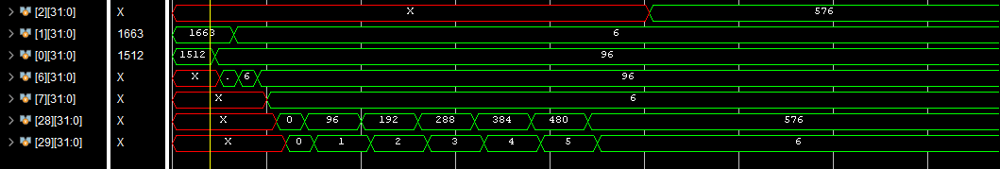

# RV32I Pipelined RISC-V Microprocessor

## 🎯 Project Goal

The goal of this project was to design and implement a **RISC-V pipelined microprocessor** that supports the full **RV32I base instruction set**, using Verilog HDL. It was built from scratch to gain practical experience in processor design, with a focus on datapath control, pipelining, and hazard resolution.

We started with a working single-cycle processor to validate functionality, and then re-architected it as a pipelined processor to improve throughput and reflect real-world designs.

---

## 🛠️ Design Approach

### Phase 1: Single-Cycle Processor

The first version used a single-cycle design, where one instruction is executed per clock cycle. This helped us ensure each module worked correctly and every instruction behaved as expected.

### Phase 2: 5-Stage Pipelined Processor

To enhance performance, we transitioned to a **5-stage pipelined architecture**, consisting of:

1. **Instruction Fetch (IF)**
2. **Instruction Decode (ID)**
3. **Execute (EX)**
4. **Memory Access (MEM)**
5. **Write Back (WB)**

To handle pipeline hazards, we implemented a **Hazard Unit** that:
- Detects data hazards (especially load-use)
- Resolves hazards using internal **forwarding logic**
- Handles control hazards from branches and jumps

---

## 🔧 Processor Components

The processor includes the following Verilog modules:

- **Instruction Fetch Unit (IFU):** Fetches instructions based on the program counter (PC).
- **Instruction Memory:** Stores and returns 32-bit instructions.
- **Register File:** 32 general-purpose registers (32-bit), with dual read and single write support.
- **ALU (Arithmetic Logic Unit):** Handles arithmetic and logical operations based on control signals.
- **Control Unit:** Decodes opcodes and generates datapath control signals.
- **Immediate Generator:** Extracts and sign-extends immediates from instruction fields.
- **Data Memory:** Supports word-level load and store operations.
- **Hazard Unit (with Forwarding):** Handles both data and control hazards to maintain pipeline flow.
- **Pipeline Registers:** Carry data and control signals between stages.

---

## ✅ Supported RV32I Instructions

### Arithmetic & Logical (Register)
- `ADD`, `SUB`, `AND`, `OR`, `XOR`, `SLL`, `SRL`, `SLT`, `SLTU`

### Arithmetic & Logical (Immediate)
- `ADDI`, `ANDI`, `ORI`, `XORI`, `SLLI`, `SRLI`, `SLTI`, `SLTIU`

### Memory Instructions
- `LW`, `SW`

### Control Flow Instructions
- `BEQ`, `BNE`, `BLT`, `BGE`, `BLTU`, `BGEU`
- `JAL`, `JALR`

Each instruction has been thoroughly tested in simulation and verified using Vivado waveform analysis.

---

## 🧠 Instruction Encoding Formats

### R-Type
| 31–25 | 24–20 | 19–15 | 14–12 | 11–7 | 6–0  |
|--------|--------|--------|--------|-------|-------|
| funct7 | rs2    | rs1    | funct3 | rd    | opcode |

→ Used for: `ADD`, `SUB`, `AND`, `OR`, `XOR`, `SLL`, `SRL`, `SLT`, `SLTU`

---

### I-Type
| 31–20     | 19–15 | 14–12 | 11–7 | 6–0  |
|------------|--------|--------|-------|-------|
| immediate  | rs1    | funct3 | rd    | opcode |

→ Used for: `ADDI`, `ANDI`, `ORI`, `XORI`, `SLLI`, `SRLI`, `SLTI`, `SLTIU`, `LW`, `JALR`

---

### S-Type
| 31–25     | 24–20 | 19–15 | 14–12 | 11–7    | 6–0  |
|------------|--------|--------|--------|---------|-------|
| imm[11:5] | rs2    | rs1    | funct3 | imm[4:0] | opcode |

→ Used for: `SW`

---

### B-Type
| 31 | 30–25 | 24–20 | 19–15 | 14–12 | 11 | 10–8 | 7 | 6–0  |
|-----|--------|--------|--------|--------|-----|------|---|-------|
| imm[12] | imm[10:5] | rs2 | rs1 | funct3 | imm[4] | imm[3:1] | imm[11] | opcode |

→ Used for: `BEQ`, `BNE`, `BLT`, `BGE`, `BLTU`, `BGEU`

---

### U-Type
| 31–12     | 11–7 | 6–0  |
|------------|-------|-------|
| immediate  | rd    | opcode |

→ Used for: `LUI`, `AUIPC`

---

### J-Type
| 31 | 30–21 | 20 | 19–12 | 11–7 | 6–0  |
|-----|--------|-----|--------|-------|-------|
| imm[20] | imm[10:1] | imm[11] | imm[19:12] | rd | opcode |

→ Used for: `JAL`

---

## 🔍 Testing & Simulation

- Custom test programs were written to validate all instructions and pipeline behavior.
- Load-use, control hazard, and forwarding scenarios were tested in depth.
- All debugging and waveform inspections were carried out using **Vivado**.

Test Code:
his program multiplies **96 × 6** using pure **RV32I instructions**, without any multiply (`MUL`) instruction or pseudo-instructions. It stores the values in memory and performs multiplication using a loop with repeated addition.

### 📄 Description

- **Input values:**
  - 96 stored at memory address `0x00`
  - 6 stored at memory address `0x04`
- **Result:**
  - Stored at memory address `0x08`

The code multiplies these numbers by repeatedly adding 96 a total of 6 times.

---

### 🧠 How it Works

```assembly
    .text
    .globl _start

_start:
    # Base address = 0x00000000
    addi    t0, x0, 0       # t0 = base address

    # Store 69 to mem[0]
    addi    t1, x0, 96      # t1 = 69
    sw      t1, 0(t0)       # mem[0] = 69

    # Store 96 to mem[4]
    addi    t1, x0, 6      # t1 = 96
    sw      t1, 4(t0)       # mem[4] = 96

    # Load num1 and num2 from memory
    lw      t1, 0(t0)       # t1 = num1 = 69
    lw      t2, 4(t0)       # t2 = num2 = 96

    # Initialize result and counter
    addi    t3, x0, 0       # t3 = result = 0
    addi    t4, x0, 0       # t4 = counter = 0

loop:
    beq     t4, t2, end     # if counter == num2, break
    add     t3, t3, t1      # result += num1
    addi    t4, t4, 1       # counter++
    jal     x0, loop        # jump back to loop

end:
    sw      t3, 8(t0)       # store result at mem[8]

hang:
    jal     x0, hang        # infinite loop to end program
---

```
**Equivalent Machine Code:**

RAM[0]<=32'h00000293;  

RAM[1]<=32'h06000313; 

RAM[2]<=32'h0062a023;   

RAM[3]<=32'h00600313;  

RAM[4]<=32'h0062a223;  

RAM[5]<=32'h0002a303;

RAM[6]<=32'h0042a383;

RAM[7]<=32'h00000e13;

RAM[8]<=32'h00000e93; 

RAM[9]<=32'h007e8863;

RAM[10]<=32'h006e0e33;

RAM[11]<=32'h001e8e93;

RAM[12]<=32'hff5ff06f;

RAM[13]<=32'h01c2a423;

RAM[14]<=32'h0000006f;

**Simulation result:**

